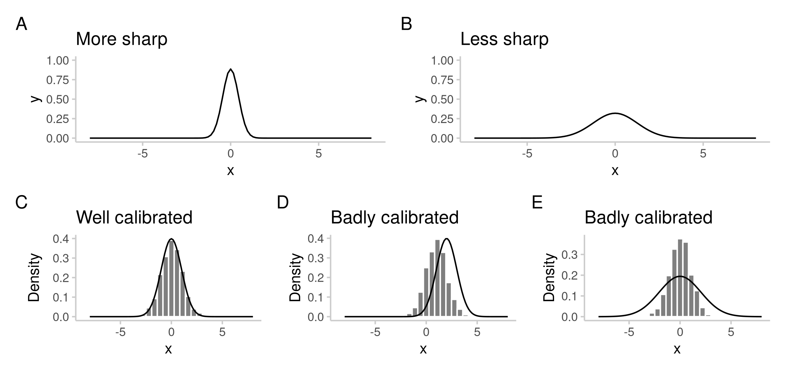

# Background {#background}

This chapter provides definitions for terms used throughout the thesis, as well as some background on forecasting and forecast evaluation.

## Forecasting and Modelling

A forecast, in most general terms, is a stated belief about the future \citep{gneitingProbabilisticForecastsCalibration2007} as it will occur. Such a belief can be stated in qualitative or quantitative terms. This thesis will almost exclusively focus on quantitative forecasts. 

Quantitative forecasts can either be probabilistic, or they can be point forecasts. A probabilistic forecast \citep{heldProbabilisticForecastingInfectious2017} is a full predictive probability distribution over multiple possible outcomes. A point forecast, on the other hand is a single number that represents a single outcome. A probabilistic forecast incorporates uncertainty about different outcomes in a way that a point forecast cannot. Probabilistic forecasts are therefore generally more useful for decision making \citep{heldProbabilisticForecastingInfectious2017} and will be the focus of this thesis. Some authors \citep[see e.g.][]{farrowHumanJudgmentApproach2017} make a distinction between 'forecast', meaning a probabilistic forecast and 'prediction', meaning a point forecast. We will use the two terms interchangeably. 

The term 'model' in the context of this thesis generally means a simplified representation of the world that allows someone to make statements about the future based on certain inputs. A model can be the specific understanding of the world that a human forecaster has in her mind to make sense of past and current events and that allows her to make forecasts about the future. More commonly, the term model denotes a mathematical or computer model, a set of encoded rules that describe and represent the processes that govern events in reality. Mathematical models usually use computers to map observed inputs to a model output. If not otherwise stated, we use the term 'model' to describe a mathematical model which produces a forecast (rather than the mental representation of the world in a person's head). Similarly, 'model-based' predictions mean predictions generated by a computational model. Furthermore, we use the term 'modeller' to denote a person who develops, codes, or adapts a mathematical model. 

<!-- Alternatively put the model part here -->

We describe anyone or anything that issues a forecast as 'a forecaster'. This can either be a person voicing their judgement, or it can be a computer model or algorithm that issues a forecast based on given inputs, or a combination of both. When more clarity is required, we use the terms 'human forecaster' and either 'mathematical model' or 'computational model'. 

The output of an epidemiological model is not necessarily a forecast. It could also, for example, be a nowcast, 
<!-- (CITATION Sam?),  -->
or a scenario or projection. A nowcast is a description of the world as it is in the present (in absence of definitive data). A scenario is the representation of the future as it could look like under certain scenario assumptions, whereas a projection describes the future as it could unfold if conditions stayed the same as they were in the past \citep{funkShorttermForecastsInform2020}. This is in contrast to a forecast which aims to predict the future as it will occur.

Forecasts (and nowcasts) can be judged eventually by comparing them against observed data. This is more difficult, and in many instances impossible, for scenarios or projections, as they usually make statements about a world that was not observed. While scenarios are harder to evaluate, they may be more useful for decision making. Scenarios are able to show what could occur under different assumptions and different courses of actions and can therefore help inform what actions should be taken. With forecasts, it less clear how results would change under a possible course of action. By definition, a forecast has to estimate and already incorporate possible courses of action in order to make an accurate statement about the future as it will occur. 

One possibility to to increase predictive accuracy of forecasts is to combine individual forecasts into an ensemble, which usually performs better than any individual forecaster \citep{gneitingWeatherForecastingEnsemble2005, yamanaSuperensembleForecastsDengue2016}. To denote an ensemble of forecasts made by a group of human forecasters we will sometimes use the term 'crowd ensemble' or 'crowd forecast'. Ensembles can be either equally weighted or trained, by assigning ensemble weights based on past performance of a forecaster. Past research suggests that it is very difficult to form ensembles which outperform an equally weighted ensemble \citep{claeskensForecastCombinationPuzzle2016}, but not impossible \citep{brooksNonmechanisticForecastsSeasonal2018}. During the COVID-19 pandemic, forecasts for different target have been systematically collected, aggregated and evaluated by three COVID-19 Forecast Hubs in the US \citep{cramerEvaluationIndividualEnsemble2022}, Germany and Poland \citep{bracherPreregisteredShorttermForecasting2021} and Europe \citep{sherrattPredictivePerformanceMultimodel2022}. 


## Forecast evaluation

Forecast evaluation in a narrow sense is the process of assessing how well a forecasters predictions align with the actual observations. In a broader sense of the term, forecast evaluation would also include elements such as an assessment of the usefulness of the forecasts to the forecast consumer, or analyses that would help understand underlying characteristics of the model or forecaster better. Forecast evaluation helps modellers and forecasters to improve future predictions, and helps decision makers decide which forecasts to take into account when making decisions. 

For any given forecasting task, the primary aim of any forecaster should be to issue a predictive distribution $F$ that equals the (usually unknown) true data-generating distribution $G$ \citep{gneitingProbabilisticForecastsCalibration2007}. We call a forecast $F$ an ideal forecast if it is equal to the data-generating distribution $G$. For an ideal forecast, we therefore have
$$F = G,$$
where $F$ and $G$ are cumulative distribution functions. 

### The forecasting paradigm 

Since the data-generating distribution $G$ is usually unknown, forecasts have to be evaluated based on the predictive distribution $F$ and the observations alone. \cite{gneitingProbabilisticForecastsCalibration2007} proposed a framework for forecast evaluation that is centred around the notion that a forecaster should aim to "maximise the sharpness of the predictive distributions subject to calibration". Calibration hereby means that the forecasts are consistent with the observations and that there are no systematic deviations between the two. In their work, \cite{gneitingProbabilisticForecastsCalibration2007} distinguish several different forms of calibration (specifically: probabilistic calibration, marginal calibration and exceedance calibration). Sharpness is a property that pertains solely to the forecast and is independent of the observations. It describes how informative the predictive distribution is, i.e. how concentrated the probability mass is around any potential outcome. The opposite of sharpness is dispersion, i.e. how spread out the predictive distribution is. Sharpness and calibration are illustrated in Figure \ref{fig:forecast-paradigm}. 
```{r setup2, include=FALSE}
knitr::opts_chunk$set(
  echo = FALSE, 
  cache = TRUE, 
  message = FALSE,
  warning = FALSE
)
```


<!-- {#fig:forecast-paradigm} -->

```{r forecast-paradigm, echo = FALSE, cache = TRUE, fig.cap="Illustration of calibration and sharpness. The probability density function of the predictive distributions are indicated by a black line, observations (draws from the unknown data-generating distribution) are represented by the grey histograms.", fig.height=4, fig.width=8}
library(ggplot2)
library(patchwork)
library(scoringutils)
library(data.table)
library(dplyr)
library(tidyr)
library(scoringRules)

titlesize <- 10

p1 <-
  ggplot(data.frame(x = seq(-8, 8, 0.01),
                    x_example = rnorm(n = 1601, mean = 0, sd = 0.45)),
         aes(x = x)) +
  geom_function(fun = dnorm, colour = "black",
                args = list(sd = 0.45)) +
  expand_limits(y = c(0, 1.0), x = c(-3, 3)) +
  scale_y_continuous(breaks = seq(0, 1, 0.25)) +
  ggtitle("More sharp") +
  labs(y = "Density") +
  theme_scoringutils()

p2 <-
  ggplot(data.frame(x = seq(-8, 8, 0.01),
                    x_example = rnorm(n = 1601, mean = 0, sd = 1.25)),
         aes(x = x)) +
  geom_function(fun = dnorm, colour = "black",
                args = list(sd = 1.25)) +
  expand_limits(y = c(0, 1.0), x = c(-3, 3)) +
  scale_y_continuous(breaks = seq(0, 1, 0.25)) +
  ggtitle("Less sharp") +
  labs(y = "Density") +
  theme_scoringutils()

p21 <- ggplot(data.frame(x = seq(-8, 8, 0.01),
                         x_example = rnorm(n = 1601, mean = 0, sd = 1.05)),
              aes(x = x)) +
  geom_histogram(aes(x = x_example, y = after_stat(density)), colour = "white", fill = "grey50") +
  geom_function(fun = dnorm, colour = "black",
                args = list(sd = 1)) +
  ggtitle("Well calibrated") +
  labs(y = "Density") +
  theme_scoringutils()

p22 <- ggplot(data.frame(x = seq(-8, 8, 0.01),
                         x_example = rnorm(n = 1601, mean = 1, sd = 1.05)),
              aes(x = x)) +
  geom_histogram(aes(x = x_example, y = after_stat(density)), colour = "white", fill = "grey50") +
  geom_function(fun = dnorm, colour = "black",
                args = list(mean = 2, sd = 1)) +
  ggtitle("Badly calibrated") +
  labs(y = "Density") +
  theme_scoringutils()

p23 <- ggplot(data.frame(x = seq(-8, 8, 0.01),
                         x_example = rnorm(n = 1601, mean = 0, sd = 1.05)),
              aes(x = x)) +
  geom_histogram(aes(x = x_example, y = after_stat(density)), colour = "white", fill = "grey50") +
  geom_function(fun = dnorm, colour = "black",
                args = list(mean = 0, sd = 2.05)) +
  ggtitle("Badly calibrated") +
  labs(y = "Density") +
  theme_scoringutils()

(p1 + p2) /
  (p21 + p22 + p23) &
  plot_annotation(tag_levels = "A") &
  theme(plot.title = element_text(size = titlesize))
```

### Proper scoring rules

Often, the quality of a forecast is summarised into a single number using so called proper scoring rules \citep{brierVerificationForecastsExpressed1950, goodRationalDecisions1952, gneitingStrictlyProperScoring2007}. A scoring rule $S(F, y)$ is a function of the forecast $F$ and the observation $y$ that returns a single numeric value. A scoring rule is said to be proper, if for an ideal forecast $F = G$, there is no forecast $F' \neq F$ that in expectation receives a better score than $F$. A scoring rule is strictly proper if there is no forecast $F'$ that in expectation receives the same score as the ideal forecast $F = G$. By convention, proper scoring rules are usually negatively oriented, meaning that smaller values are better and the best possible score is usually zero. In that sense the score can be understood as a penalty. Among the strictly proper scoring rules most commonly used are the logarithmic scoring rule \citep{goodRationalDecisions1952} and the continuous ranked probability score (CRPS) \citep{epsteinScoringSystemProbability1969, murphyNoteRankedProbability1971, mathesonScoringRulesContinuous1976, gneitingStrictlyProperScoring2007}. 

#### The logarithmic scoring rule
The logarithmic scoring rule is simply the negative log-likelihood of the predictive distribution evaluated at the observed value, i.e. 
$$ \text{log score} = -\log f(y), $$
where $f$ is the predictive probability density function (PDF) and y is the observed value. For discrete forecasts, the log score can be computed as
  $$ \text{log score} = -\log p_y, $$
where $p_y$ is the probability assigned to the observed outcome $y$ by the forecast $F$. The logarithmic scoring rule can produce large penalties when the observed value takes on values for which $f(y)$ (or $p_y$) is close to zero. It is therefore considered to be sensitive to outlier forecasts. This may be desirable in some applications, but it also means that scores can easily be dominated by a few extreme values. The logarithmic scoring rule is a local scoring rule, meaning that the score only depends on the probability that was assigned to the actual outcome (see Figure \ref{fig:illustration-global-local}). This is often regarded as a desirable property for example in the context of Bayesian inference \citep{winklerScoringRulesEvaluation1996}. It implies for example, that the ranking between forecasters would be invariant under monotone transformations of the predictive distribution and the target. 

#### The continuous ranked probability score

The continuous ranked probability score (CRPS) is popular in fields such as meteorology and epidemiology. The CRPS is defined as 
$$\text{CRPS}(F, y) = \int_{-\infty}^\infty \left( F(x) - 1(x \geq y) \right)^2 dx,$$ 
where $y$ is the observed value and $F$ the CDF of predictive distribution. For discrete forecasts, the ranked probability score (RPS) can be used instead: 
$$ \text{RPS}(F, y) = \sum_{x = 0}^\infty (F(x) - 1(x \geq y))^2.$$
The CRPS can be understood as a generalisation of the absolute error to predictive distributions \citep{gneitingStrictlyProperScoring2007}. It can also be understood as the integral over the Brier score \citep{brierVerificationForecastsExpressed1950} for the binary probability forecasts implied by the CDF for all possible observed values. The CRPS is also related to the Cramér-distance between two distribution and equals the special case where one of the distributions is concentrated in a single point (see e.g. \cite{zielEnergyDistanceEnsemble2021}). The CRPS is a global scoring rule, meaning that the entire predictive distribution is taken into account when determining the quality of the forecast (see Figure \ref{fig:illustration-global-local}). 

```{r illustration-global-local, fig.cap = "Forecasts from two forecasters, A and B, for the number of points scored by a team in a sports match \\citep[adapted from][]{bosseEvaluatingForecastsScoringutils2022}. Grey bars represent the probability assigned to each outcome. The outcome later observed, 2, is marked with a black dashed line. The probability assigned to the observed outcome is the same for both forecasters. However, Forecaster A's prediction centers closely around the observed value, whereas Forecaster B allocates substantial probabilities to outcomes distant from the observed value. A local scoring rule like the logarithmic scoring rule assigns both forecasters the same score. A global scoring rule like the CRPS, which takes the full distribution into account, assigns a better score to Forecaster A.", fig.width=8, fig.height=3}
quantiles <- seq(0.1, 1, 0.1)
forecast_a <- c(0.3, 0.35, 0.25, 0.04, 0.02, 0.01, 0.01, 0.01, 0.005, 0.005)
forecast_b <- c(0.1, 0.35, 0.05, 0.02, 0.01, 0.01, 0.05, 0.07, 0.2, 0.14)
true_value <- 2

df <- data.table(
  forecaster = rep(c("Forecaster A", "Forecaster B"), each = 10),
  outcome = rep(1:10, 2),
  prob = c(forecast_a, forecast_b),
  true_value = true_value
)

df[, crps := sum((cumsum(prob) - (outcome >= true_value))^2),
   by = c("forecaster")]
df[, log_score := -log(prob[outcome == true_value]),
   by = c("forecaster")]
df[, mean_pred := sum(prob * outcome) / sum(prob),
   by = c("forecaster")]
df[, sd_pred := sqrt(sum((prob * outcome - mean_pred)^2)),
   by = c("forecaster")]
df[, log_score := -log(prob[outcome == true_value]),
   by = c("forecaster")]

# sense-check: compute crps using samples
sample_a <- sample(x=1:10, size = 1e5, replace = TRUE, prob = forecast_a)
sample_b <- sample(x=1:10, size = 1e5, replace = TRUE, prob = forecast_b)

crps_a <- scoringutils::crps_sample(2, t(as.matrix(sample_a)))
crps_b <- scoringutils::crps_sample(2, t(as.matrix(sample_b)))

annotation <- df[, .(forecaster, crps, log_score)] |> unique()


ggplot(df, aes(x = factor(outcome), y = prob)) +
  geom_col() +
  geom_text(data = annotation, x = 4, y = 0.3, hjust = "left", size = 3,
            aes(label = paste("CRPS: ", round(crps, 2)))) +
  geom_text(data = annotation,x = 4, y = 0.27, hjust = "left", size = 3,
            aes(label = paste("Log score: ", round(log_score, 2)))) +
  facet_wrap(~ forecaster) +
  geom_vline(aes(xintercept = 2), linetype = "dashed") +
  theme_scoringutils() +
  labs(y = "Probability assigned", x = "Possible outcomes")
```

Compared to the logarithmic scoring rule, the CRPS is also relatively more lenient when it comes to penalising poor forecasts. In particular, the logarithmic scoring rule penalises overconfidence more severely than the CRPS \citep[see Figure \ref{fig:score-outliers}A, as well as][]{macheteContrastingProbabilisticScoring2012}. The CRPS, as a generalisation of the absolute error, grows linearly with the distance of the predictive distribution from the observed value. This is not true for the log score, which can grow quickly if the density or probability assigned to the observed outcome is small (see Figure \ref{fig:score-outliers}B). 

```{r score-outliers, echo = FALSE, cache = TRUE, fig.cap="Effect of deviations from the data-generating distribution on the log score and the CRPS \\citep[adapted from][]{bosseEvaluatingForecastsScoringutils2022}). A: Effect of varying the standard deviation, while keeping the mean constant. The data-generating distribution is $\\mathcal{N}(0,5)$ (true sd is marked by the dashed black line). The standard deviation of the forecast distribution is varied along the x-axis. Coloured lines therefore represent expected scores for a data-generating distribution of $\\mathcal{N}(0,5)$ and a predictive distribution $\\mathcal{N}(0,x)$. The log score penalises overconfidence (i.e. predictive distributions to the left of the dashed line, which are too sharp / underdispersed) more severely than the CRPS. B: Effect of keeping the predictive distribution constant, while varying the observed value. The predictive distribution (illustrated in grey) is $\\mathcal{N}(0,1)$. Coloured lines show the scores obtained for a standard normal forecast distribution and different observed values. The CRPS grows linearly with the observed value, while the logarithmic scoring rule produces increasingly larger penalties than the CRPS for observed values that were deemed unlikely by the predictive distribution.", fig.show="hold", fig.width=8, fig.height=3}
library(data.table)
library(ggplot2)
library(scoringutils)
library(patchwork)
set.seed(1234)
n_steps = 500
n_rep <- 1e4
true_mean = 0
true_sd = 5
true_values <- rnorm(n = n_rep, mean = true_mean, sd = true_sd)
sd <- 10^(seq(-1, 1.4, length.out = n_steps))
mu <- seq(0, 100, length.out = n_steps)


# look at effect of change in sd on score
res_sd <- data.table(sd = sd, mu = true_mean)

res_sd[, `:=`(CRPS = mean(scoringRules::crps(y = true_values, family = "normal", mean = mu, sd = sd)),
               `Log score` = mean(scoringRules::logs(y = true_values, family = "normal", mean = mu, sd = sd))),
       by = "sd"]

deviation_sd <- res_sd |>
  melt(id.vars = c("sd", "mu"), value.name = "value", variable.name = "Score") |>
  ggplot(aes(x = sd, y = value, color = Score)) +
  geom_line() +
  scale_color_discrete(type = c("#E69F00", "#56B4E9", "#009E73")) +
  theme_scoringutils() +
  geom_vline(aes(xintercept = 5), linetype = "dashed") +
  # scale_x_continuous(trans = "log10") + 
  coord_cartesian(ylim=c(0, 20)) +
  annotate(geom="text", x=6, y=18, label="Sd of true \ndata-generating \ndistribution: 5",
           color="black", hjust = "left", size = 3) +
  labs(y = "Score", x = "Standard deviation of predictive distribution")

# define simulation parameters
true_values <- seq(0, 4, length.out = 1000)
true_sd = 1
true_mu = 0

# look at effect of change in sd on score
res_mu2 <- data.table(true_value = true_values)

res_mu2[, `:=`(CRPS = scoringRules::crps(y = true_value, family = "normal", mean = true_mu, sd = true_sd) / 10,
                `Log score` = scoringRules::logs(y = true_value, family = "normal", mean = true_mu, sd = true_sd) / 10)]

label_fn <- function(x) {
  paste(10*x)
}

outlier <- res_mu2 |>
  melt(id.vars = c("true_value"), value.name = "value", variable.name = "Score") |>
  ggplot(aes(x = true_value, y = value, color = Score)) +
  geom_line() +
  theme_scoringutils() +
  annotate(geom="text", x=0, y=.8, label="Predictive distribution: \nN(0,1)",
           color="black", hjust = "left", size = 3) +
  labs(y = "Score", x = "Observed value") +
  scale_color_discrete(type = c("#E69F00", "#56B4E9", "#009E73")) +
  geom_area(stat = "function", fun = dnorm, color = "grey", fill = "grey", alpha = 0.5, xlim = c(0, 4)) +
  scale_y_continuous(label = label_fn)


layout <- "
AB
"

plot <- 
  deviation_sd + outlier +
  plot_layout(guides = "collect",
              design = layout) &
  plot_annotation(tag_levels = "A") &
  theme(legend.position = "bottom")

plot


```

Both log scores and CRPS values scale with the standard deviation of the target data-generating distribution, as forecasting an uncertain target is inherently more difficult. If the predictive distribution can be well approximated by a normal distribution, CRPS values of an ideal forecaster (for which the forecast $F$ equals the data-generating distribution $G$) scale linearly with the standard distribution \citep{bosseTransformationForecastsEvaluating2023}. This can make it difficult to compare CRPS values across forecasts for targets with differing orders of magnitudes, as will be discussed in more detail in Chapter \ref{sec:LogTransformation}. The log score mostly scales sub-linearly with the standard deviation of the data-generating distribution. This is illustrated in Figure \ref{fig:score-scale}B.

```{r score-scale, echo = FALSE, cache = TRUE, fig.cap="Dependency of scores on the variability of the data-generating distribution. Consider data generated from different normal distributions with differing means and standard deviations. Predictive distributions are assumed to be equal to the data-generating distribution. For every combination of mean and standard deviation, we drew 10k samples from the data-generating distribution, evaluated them, and calculated the mean and the standard deviation of the scores. A: Constant standard deviation $\\sigma = 1$ of the data-generating and predictive distribution, varying mean. B: Constant mean ($\\mu = 1$) of the data-generating and predictive distribution, varying standard deviation."}

simulate <- function(n_replicates = 1e4,
                     true_value = 1,
                     scale_mean = 1,
                     scale_sd = scale_mean) {
  
  mean = true_value * scale_mean
  sd = true_value * scale_sd
  
  observed <- rnorm(n_replicates, mean = mean, sd = sd)
  
  df <- data.table(
    observed = observed, 
    CRPS = scoringRules::crps(y = observed, family = "normal", mean = mean, sd = sd),
    "Log score" = scoringRules::logs(y = observed, family = "normal", mean = mean, sd = sd)
  )
  
  df |> 
    pivot_longer(cols = c(CRPS, `Log score`), 
                 values_to = "value", names_to = "Scoring rule") |>
    group_by(`Scoring rule`) |>
    summarise("Mean score" = mean(value), "Sd score" = sd(value), .groups = "drop_last") |>
    pivot_longer(cols = c(`Mean score`, `Sd score`), 
                 values_to = "value", names_to = "type")
}

scales_mean <- scales_sd <- c(1, 2, 5, 10, 20, 50)

grid <- expand.grid(
  scale_mean = scales_mean,
  scale_sd = scales_sd
) 
df <- grid |>
    rowwise() |>
    mutate(simulation := list(simulate(scale_mean = scale_mean, scale_sd = scale_sd))) |> 
  tidyr::unnest(cols = "simulation")

p1 <- df |>
  filter(scale_mean == 1, 
         scale_sd < 20) |>
  ggplot(aes(y = value, x = scale_sd,
             group = `Scoring rule`, color = `Scoring rule`)) +
  geom_line() +
  facet_wrap(~ type, scales = "free") +
  scale_color_discrete(type = c("#E69F00", "#56B4E9", "#009E73")) +
  theme_scoringutils() +
  labs(y = "Score", x = "Sd of F and G (mean constant)")


p2 <- df |>
  filter(scale_sd == 1, 
         scale_mean < 20) |>
  ggplot(aes(y = value, x = scale_mean,
             group = `Scoring rule`, color = `Scoring rule`)) +
  geom_line() +
  facet_wrap(~ type, scales = "free") +
  scale_color_discrete(type = c("#E69F00", "#56B4E9", "#009E73")) +
  theme_scoringutils() +
  labs(y = "Score", x = "Mean of F and G (sd constant)")

p2 / p1 +
  plot_layout(guides = "collect") &
  theme(legend.position = "bottom") &
  plot_annotation(tag_levels = 'A')
```

In situations where forecasts are represented not as a closed-form distribution, but for example by a set of samples from the predictive distribution, the CRPS has an advantage over the logarithmic scoring rule in terms of estimation. Computing the log score for continuous forecasts requires estimating a predictive density from the samples. For that reason, estimating the log score from predictive samples can often be noisy and require a large number of samples to work well. This is illustrated in Figure \ref{fig:score-convergence} \citep[adapted from][]{jordanEvaluatingProbabilisticForecasts2019}). 

```{r score-convergence, echo = FALSE, cache=TRUE, fig.cap="Estimates of the log score and CRPS derived from predictive samples, as adapted from \\cite{jordanEvaluatingProbabilisticForecasts2019} (see also \\cite{bosseEvaluatingForecastsScoringutils2022}). The observed value was assumed to be 0, the predictive distribution was $\\mathcal{N}(0,3)$. Scores were computed using samples of varying sizes from the $\\mathcal{N}(2,3)$ predictive distriution. Sample sizes ranged from 10 to 100,000. For each sample size, the process was repeated 500 times. The black line represents the mean score across these 500 repetitions, while the shaded areas indicate 50\\% and 90\\% confidence intervals. Additionally, the dashed line corresponds to the true score, calculated based on the closed-form distribution.", fig.show="hold", fig.width=8, fig.height=3}
sample_sizes <- seq(50, 5000, 50)
sample_sizes <- round(1 * 10^(seq(1, 5, 0.1)))
n_rep <- 500

true_value = 0
sd <- 3
mu <- 2

# analytical scores
true_crps <- scoringRules::crps(y = 0, family = "normal", mean = mu, sd = sd)
true_logs <- scoringRules::logs(y = 0, family = "normal", mean = mu, sd = sd)

filepath <- "../data/sample-convergence.rds"
if (!file.exists(filepath)) {
  results <- list()
  for (i in sample_sizes) {
    samples <- as.data.table(
      replicate(n_rep,
                rnorm(n = i, mean = mu, sd = sd))
    )
    setnames(samples, as.character(1:n_rep))
    samples[, sample_id := 1:i]
    samples <- melt(samples, id.vars = "sample_id",
                    variable.name = "repetition",
                    value.name = "predicted")
    samples[, observed := true_value]
    results[[paste(i)]] <- score(
      samples, metrics = list(
        "crps" = scoringRules::crps_sample, 
        "log_score" = scoringRules::logs_sample
      )
    )[, n_samples := i]
  }
  
  results <- rbindlist(results)
  results <- melt(results, id.vars = c("n_samples", "repetition", "model"),
                  variable.name = "score")
  df <- results[, .(mean = mean(value),
                    quantile_0.05 = quantile(value, 0.05),
                    quantile_0.25 = quantile(value, 0.25),
                    quantile_0.75 = quantile(value, 0.75),
                    quantile_0.95 = quantile(value, 0.95)),
                by = c("n_samples", "score")]
  df[score == "crps", true_score := true_crps]
  df[score == "log_score", true_score := true_logs]
  df[, score := ifelse(score == "crps", "CRPS", "Log score")]
  saveRDS(df, filepath)
} else {
  df <- readRDS(filepath)
}

label_fn <- function(x) {
  ifelse (x >= 1000,
          paste0(x / 1000, "k"),
          x)
}

p_convergence <- ggplot(df, aes(x = n_samples)) +
  geom_line(aes(y = mean)) +
  geom_ribbon(aes(ymax = quantile_0.95, ymin = quantile_0.05),
              alpha = 0.1) +
  geom_ribbon(aes(ymax = quantile_0.75, ymin = quantile_0.25),
              alpha = 0.3) +
  geom_hline(aes(yintercept = true_score), linetype = "dashed") +
  facet_wrap(~ score, scales = "free") +
  scale_x_continuous(trans = "log10", labels = label_fn) +
  theme_scoringutils() +
  labs(x = "Number of samples",
       y = "Score based on samples")

p_convergence
```


#### The weighted interval score

Recent forecasting efforts such as the COVID-19 Forecast Hubs in the US \citep{cramerEvaluationIndividualEnsemble2022}, Europe \citep{sherrattPredictivePerformanceMultimodel2022}, and Germany and Poland \citep{bracherPreregisteredShorttermForecasting2021, bracherNationalSubnationalShortterm2022} have used a quantile format, with predictive distributions represented by a set of predictive quantiles. While predictive samples can offer richer information (for example, traces of of Markov Chain Monte Carlo (MCMC) simulations can be stored that include information about spatial or temporal correlations), they are expensive in terms of storage space. Accurately representing the predictive distribution, especially in its tails, may require a large number of predictive samples. Predictive quantiles, on the other hand, require much less storage space to represent the distribution accurately (while losing information about the correlation structure between different targets). 

A proper scoring rule that is well suited to evaluate forecasts in such a quantile format is the weighted interval score (WIS). The WIS can be understood as an approximation of the CRPS for forecasts in a quantile format. Quantiles are assumed to be the lower and upper bounds of prediction intervals symmetric around the median. The interval score for a single interval is 
  $$IS_\alpha(F,y) = \underbrace{(u-l)}_\text{dispersion} + \underbrace{\frac{2}{\alpha} \cdot (l-y) \cdot \mathbf{1}(y \leq l)}_{\text{overprediction}} + \underbrace{\frac{2}{\alpha} \cdot (y-u) \cdot \mathbf{1}(y \geq u)}_{\text{underprediction}}, $$
  where $\mathbf{1}()$ is the indicator function, $y$ is the observation, and $l$ and $u$ are the $\frac{\alpha}{2}$ and $1 - \frac{\alpha}{2}$ quantiles of the predictive distribution $F$. $l$ and $u$ together form the prediction interval. The interval score can be understood as the sum of three components: dispersion, overprediction and underprediction. For a set of $K$ prediction intervals and the median $m$, the score is given as a weighted sum of individual interval scores, i.e.
  $$WIS = \frac{1}{K + 0.5} \cdot \left(w_0 \cdot |y - m| + \sum_{k = 1}^{K} w_k \cdot IS_{\alpha}(F, y)\right),$$
where $w_k$ is a weight assigned to every interval. When the weights are set to $w_k = \frac{\alpha_k}{2}$ and $w_0 = 0.5$, then the WIS converges to the CRPS for an increasing number of equally spaced quantiles.
  
Scoring rules and evaluation metrics describe a mathematical relationship between forecasts and observations and capture different aspects of how a forecast deviates from observed values. This makes them objective and comparable. However, scoring rules and evaluation measures usually don't directly measure the usefulness of forecasts to forecast consumers. For example, underprediction of a target like hospitalisations could lead to more severe consequences than overprediction for a decision maker relying on a forecast in a way that's not necessarily captured by a given scoring rule. The selection of an appropriate metric therefore should ideally reflect the qualities a forecast consumer values in a forecast. 

<!-- Chapter \ref{sec:LogTransformation} suggests an additional transformation of the forecasts and observations that can make the CRPS more suitable for evaluating forecasts in an epidemiological setting.  -->

<!-- A second issue arises in the presence of missing forecasts, where forecasters differ in what targets they have issued a forecast for. @cramerEvaluationIndividualEnsemble2022 have proposed a pairwise tournament between models based on the set of overlapping forecasts. A third issue is the complexity of obtaining and presenting results across many dimensions, such as e.g. time, location and forecast targets. Chapter \@ref(sec:scoringutils) presents `scoringutils`, an `R` package that facilitates forecast evaluation, visual presentation of results, and also implements the pairwise comparison approach suggested in @cramerEvaluationIndividualEnsemble2022.  -->


## Human Judgement forecasting

Human judgement forecasting has a long history and efforts have been made in very different contexts and fields, both inside and outside of academia. Human judgement elicitation processes also differ greatly in their methodology and selection of forecasters. Efforts in the past range from surveys of experts or laypeople, to structured discussions between experts aimed to produce a consensus forecast to large crowd forecasting efforts with thousands of forecasters predicting on a given question. One of the first structured methods proposed to support decision making through forecasting is the Delphi method developed by the RAND Corporation in the 1950s in the context of the Cold War [@dalkeyExperimentalApplicationDELPHI1963; @bernicebrownDELPHIPROCESSMETHODOLOGY1968; @pagePrescribingAustraliansLiving2015]. Forecasts were elicited in a structured process where experts would provide a first estimate, then discuss their estimates and potential disagreements, and then provide a final round of estimates. 

<!-- Several reviews have been published on human judgement forecasting, beginning with Armstrong et al. (1986).  -->
<!-- (Bunn and Wright, 1991; Goodwin and Wright, 1993; Lawrence et al., 2006; Webby and O'Connor, 1996) (focusing on comparing performance of humans and models). -->

<!-- @zellnerSurveyHumanJudgement2021 (https://royalsocietypublishing.org/doi/10.1098/rsos.201187) provides a comprehensive literature review of human judgement forecasting approaches. @arvanIntegratingHumanJudgement2019 gives a review of academic papers that combine human judgement and mathematical modelling, focusing on product forecasting. @mcandrewAggregatingPredictionsExperts2021 review methods to aggregate predictions from experts.  -->

Outside of academia, human predictions and estimates are routinely used to help decision making in private companies, think tanks and governments. In addition, public predictions on various topics of interest have been collected on several online prediction markets or prediction platforms. Prediction markets such as PredictIt (\url{https://www.predictit.org/}), Manifold\footnote{\url{https://manifold.markets/}}, Polymarket\footnote{\url{https://polymarket.com}} and traditional betting platforms such as betfair\footnote{\url{https://betfair.com}} allow users to place bets on an outcome by spending either real money or token money to buy "yes" or "no"-shares in the binary outcome of a given market. Prediction platforms such as Metaculus\footnote{\url{https://metaculus.com}}, INFER\footnote{\url{https://infer-pub.com}} or Good Judgement Open\footnote{\url{https://gjopen.com}} elicit direct forecasts from users and offer either points or sometimes monetary rewards for the most accurate users. These markets and platforms have been used in predicting a broad spectrum of events such as elections, wars, or the spread of infectious diseases. 

Academic authors working on human judgement forecasting have in the past made use of such prediction platforms \citep{mcandrewChimericForecastingCombining2022, mcandrewEarlyHumanJudgment2022, tetlockForecastingTournamentsTools2014}, used more traditional means of eliciting predictions such as surveys \citep{recchiaHowWellDid2021} or the Delphi method \citep{dalkeyExperimentalApplicationDELPHI1963, bernicebrownDELPHIPROCESSMETHODOLOGY1968, pagePrescribingAustraliansLiving2015}, or developed their own methods \citep{farrowHumanJudgmentApproach2017}.
While human judgement forecasting has seen many applications in academic fields such as such as geo-politics \citep{atanasovDistillingWisdomCrowds2016, tetlockForecastingTournamentsTools2014}, product forecasting \citep{arvanIntegratingHumanJudgement2019}, or meta-science \citep{dreberUsingPredictionMarkets2015, gordonAreReplicationRates2020}, its application to infectious diseases has only recently attracted more widespread attention. Notable examples of human judgement forecasting of infectious diseases include \cite{farrowHumanJudgmentApproach2017, recchiaHowWellDid2021, mcandrewExpertJudgmentModel2022, mcandrewAggregatingHumanJudgment2022, mcandrewChimericForecastingCombining2022, mcandrewEarlyHumanJudgment2022, daviesHumanJudgementForecasting2022}. 

Human judgement forecasting is not always feasible, especially at scale, due to the time and effort required of human forecasters. However, Human judgement forecasting has various attractive qualities compared to mathematical models. In particular in the early stages of an outbreak, humans may be able to provide rapid forecasts based on very sparse observational data and can make use of contextual information that is difficult to incorporate into mathematical modelling. They may also help provide guidance on questions that computational models cannot answer, such as whether a state or an organisation like the World Health Organisation will provide assistance to help with an outbreak. 

Before the beginning of this PhD only one paper, namely \citet{farrowHumanJudgmentApproach2017} for influenza and chikungunya, had directly compared the performance of human judgement forecasts of infectious diseases against predictions made by computational models. Since then, three more papers have examined the performance of human judgement forecasts of COVID-19 in direct comparison to computational models, two of them form part of this PhD \citep{bosseComparingHumanModelbased2022, mcandrewChimericForecastingCombining2022, 10.12688/wellcomeopenres.19380.1}. Results overall suggest that a crowd of human forecasters can achieve performance comparable to that of an ensemble of computational models. 


<!-- - Open things:  -->
<!--   - direct 1:1 comparison -->
<!--   - analysis of what human judgment adds to a computer model -->
<!--   - no open source tools to  -->

<!-- ### Crowdforecastr -->

<!-- - Crowdforecastr tool -->
<!--   - R shiny -->
<!--   - probabilistic forecasting -->


<!-- ## Mathematical modelling of infectious diseases -->

<!-- - uses computers -->
<!-- - necessarily some combination of human judgement and algorithmic assumptions -->
<!-- - varying degrees of human intervention.  -->


<!-- From paper:  -->
<!-- Individual computational models usually rely to varying degrees on mechanistic assump- tions about infectious disease dynamics (such as SIR-type compartmental models that aim to represent how individuals move from being susceptible to infected and then recovered or dead). Some are more statistical in nature (such as time series models that detect statistical pat- terns without explicitly modelling disease dynamics). How exactly such a mathematical or computational model is constructed and which assumptions are made depends on subjective opinion and judgement of the researcher who develops and refines the model. Models are commonly adjusted and improved based on whether the model output looks plausible to the researchers involved. -->

<!-- ### Mechanistic models -->

<!-- - mechanistic assumptions about disease progress -->
<!-- - learning about paramters  -->
<!-- - SIR models -->

<!-- ### Statistical models -->

<!-- - uses statistical features, without making any assumptions about the disease progress -->

<!-- ### Semi-mechanistic models -->

<!-- Mixture of the two -->

<!-- ## Data sources -->

<!-- ### German and Polish Forecast Hub -->

<!-- - cite papers -->
<!-- - one of several Forecast Hubs.  -->

<!-- ### Human forecasts of COVID-19 in Germany and Poland -->

<!-- - Collected using crowdforecastr -->
<!-- - Ethics approval: NUMBER -->

<!-- ### European Forecast Hub  -->
